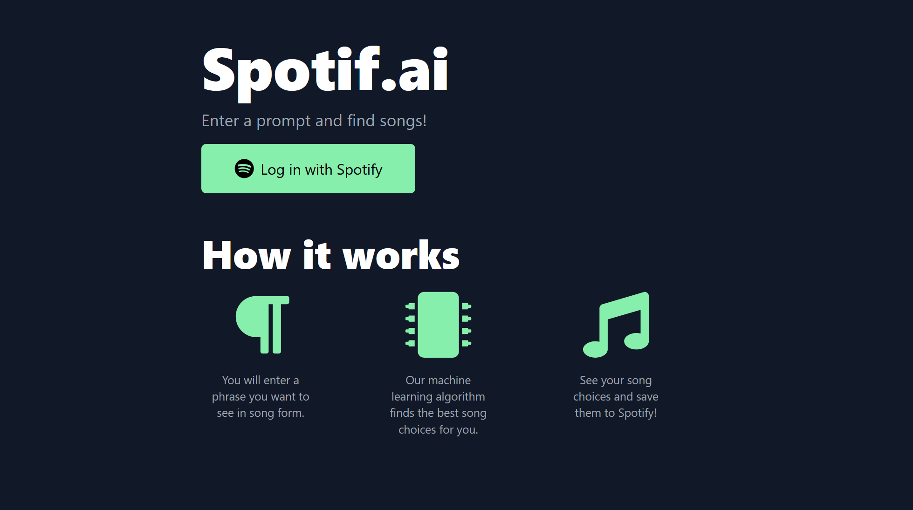
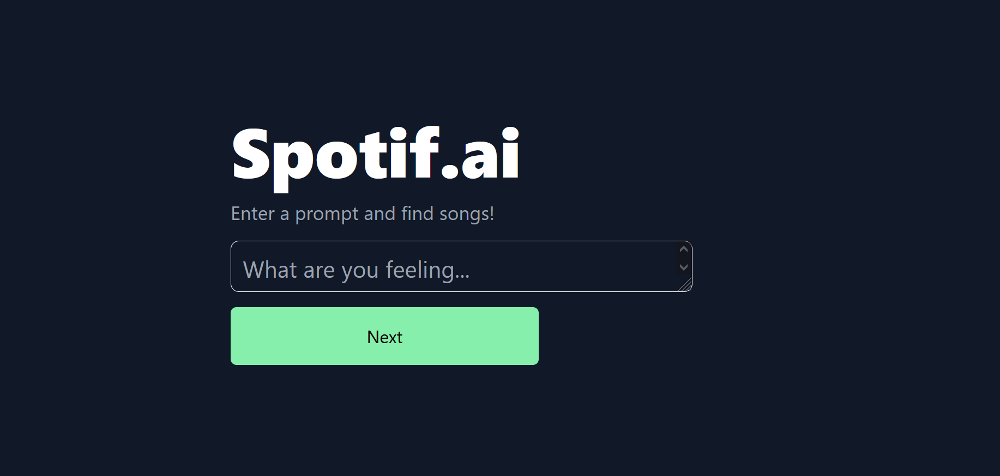
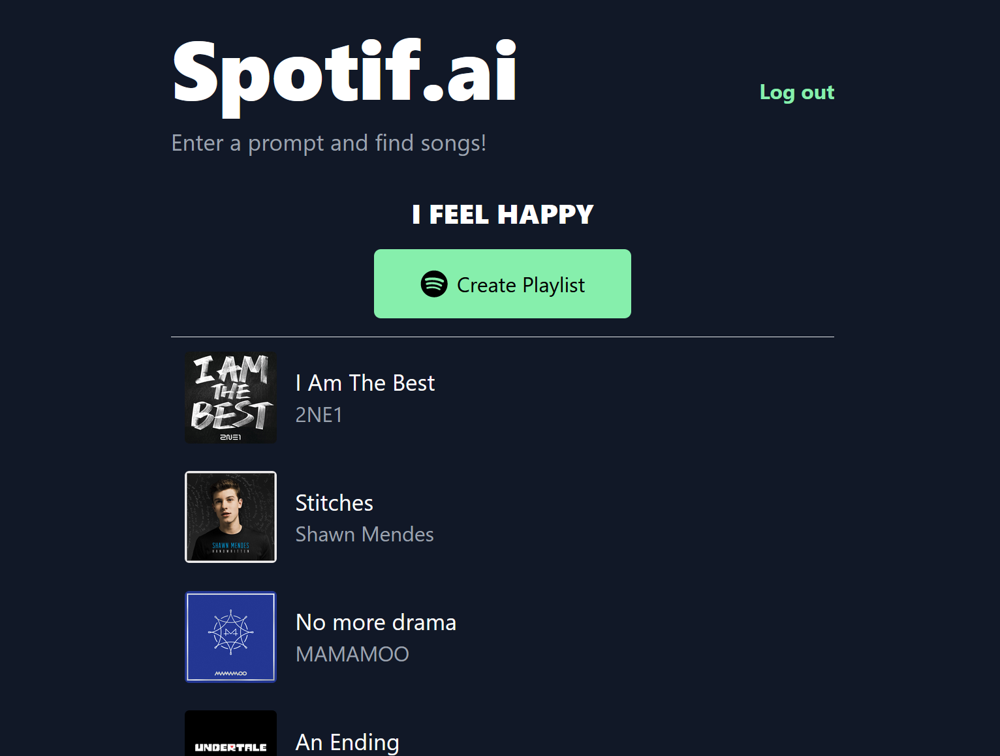

# spotifai-front

Type in any text, and spotif.ai analyzes your phrase and creates a Spotify playlist for you based on your phrase.

Built for nwHacks 2022

This is the repo for the frontend client of spotif.ai

See the [source code for the backend](https://github.com/PrayusShrestha/spotif.ai)!

## Features

You can:

- enter a prompt

- see generated songs based on your personal music taste, seeded by your prompt
- create a playlist of your generated songs!

## Technologies

- React
- TailwindCSS

## Setup

Clone this repository.

Create a `.env` file (see `.env_template`). Go to [Spotify for Developers](https://developer.spotify.com/dashboard/login) and create an app in your dashboard. The client ID of your created app can be used for the environment variable `REACT_APP_CLIENT_ID`.

Run `npm install`.

## Development

Run `npm start`

## Contributors

[Akash](https://github.com/Akash2002)

[Evan](https://github.com/Evanyl)

[Kate](https://github.com/katejh)

[Prayus](https://github.com/PrayusShrestha)
